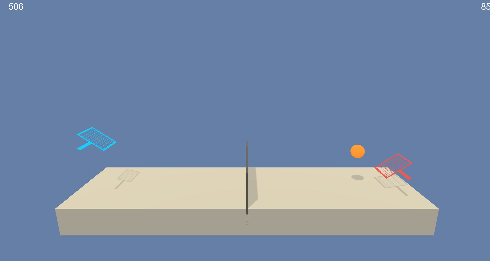

# Collaboration & Competition Project

This is a project for Udacity Nanodegree program Deep Reinforcement learning. In this environment, two agents control rackets to bounce a ball over a net. If an agent hits the ball over the net, it receives a reward of +0.1. If an agent lets a ball hit the ground or hits the ball out of bounds, it receives a reward of -0.01. Thus, the goal of each agent is to keep the ball in play.

The observation space consists of 8 variables corresponding to the position and velocity of the ball and racket. Each agent receives its own, local observation. Two continuous actions are available, corresponding to movement toward (or away from) the net, and jumping.

This project will be considered solved if the agent yields average score of +0.5 over 100 consecutive episodes.

## Getting Started
Following the instruction below to setup your development environment.
1. Follow the instruction from [this link](https://github.com/udacity/deep-reinforcement-learning#dependencies) to setup your python development and install dependencies.
2. Download this repository.
3. Download one of the Unity Environment based on your operating system pre-build by Udacity.
    - Linux: [click here](https://s3-us-west-1.amazonaws.com/udacity-drlnd/P3/Tennis/Tennis_Linux.zip)
    - Mac OSX: [click here](https://s3-us-west-1.amazonaws.com/udacity-drlnd/P3/Tennis/Tennis.app.zip)
    - Windows (32-bit): [click here](https://s3-us-west-1.amazonaws.com/udacity-drlnd/P3/Tennis/Tennis_Windows_x86.zip)
    - Windows (64-bit): [click here](https://s3-us-west-1.amazonaws.com/udacity-drlnd/P3/Tennis/Tennis_Windows_x86_64.zip)

    Put the file in this repository folder and unzip the file.
4. Run jupyter notebook in the root of this repository, if you don't have it yet you can [click here](https://jupyter.org/install) to install.
5. Follow along the instruction in Tennis.ipynb to train and test the model.