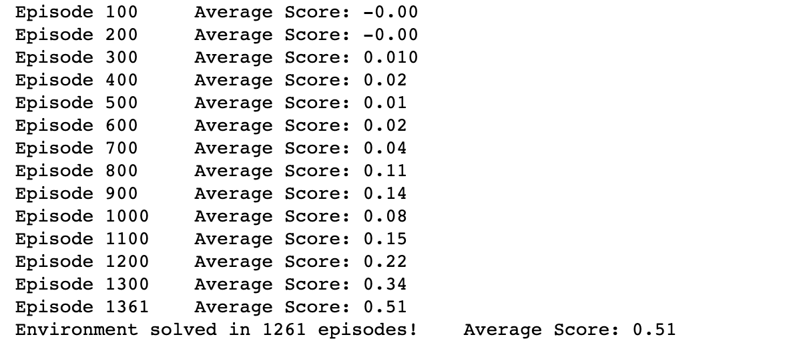
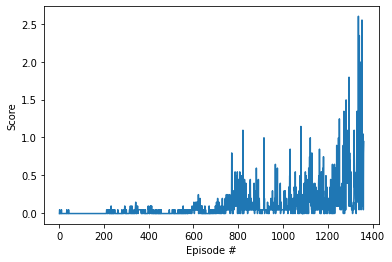

# Report
This environment is solved using Deep Deterministic Policy Gradient (DDPG) algorithm. DDPG is a reinforcement learning technique that combines both Q-learning and Policy Gradients. DDPG is Actor-Critic method consists of two methods: Actor and Critic. Actor proposes an action given a state and Critic predicts if the action is good (positive value) or bad (negative value) given a state and an action.
Both the actor and critic is compose of a local network and a target network. The actor is being used to estimate the best action and the critic then uses that value as in a DDQN to evaluate the optimal action value.

Both the actor and critic is composed of 2 hidden layers (128, 128) units each with relu activation.

## Actor -
- fc1 (input = 24, output = 128)
- fc2 (input = 128, output = 128)
- fc3 (input = 128, output = 2)

## Critic - 
- fc1 (input = 24, output = 128)
- fc2 (input = 128, output = 128)
- fc3 (input = 128, output = 1)

The agent is being trained based on the following learning parameters.
- Replay buffer size for experience replay: 1e5
- Batch size of: 128
- Discount factor Gamma as: 0.99
- Soft update value of: 1e-3
- Learning rate (actor): 1e-3
- Learning rate (critic): 1e-3
- Weight decay = 0

## Reward plot
#### The environment were solved in 1261 episodes.

#### Rewards Graph

## Future ideas
Implementing other models such as PPO, A3C, D4PG will be a good idea for learning purpose and to compare the performance.
As well as implementation to solve Soccer environment.